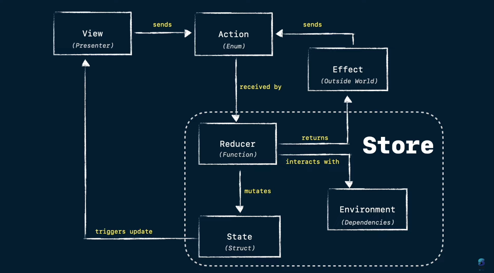
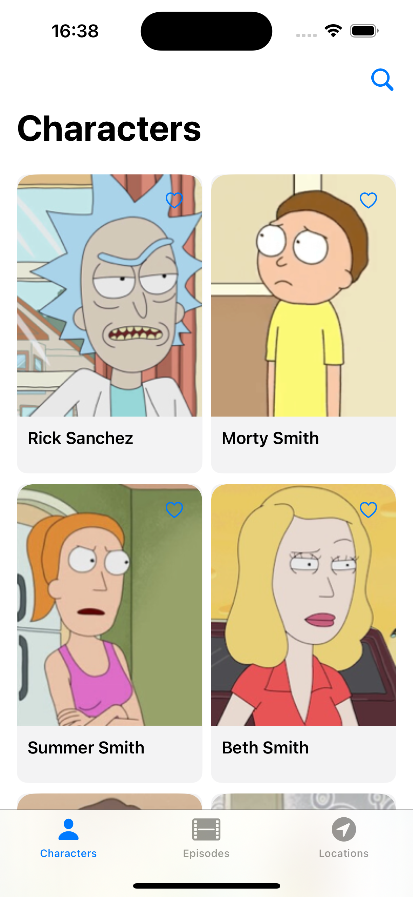
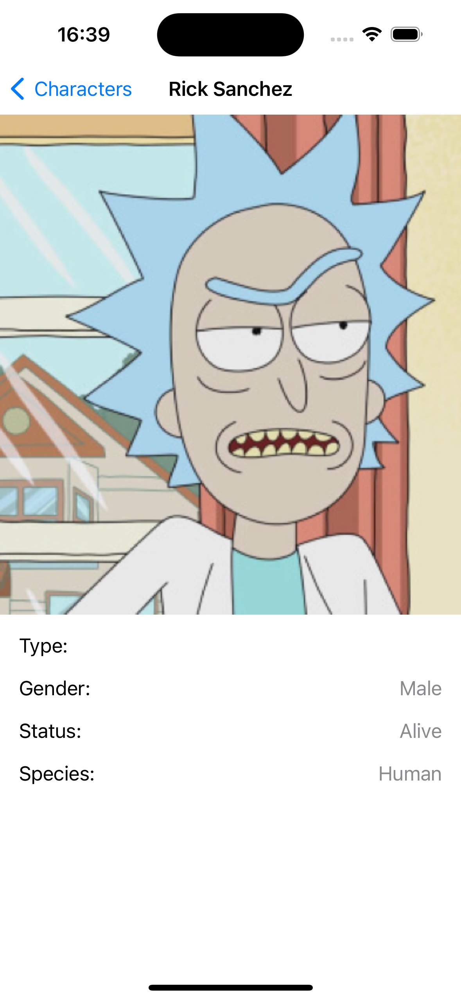
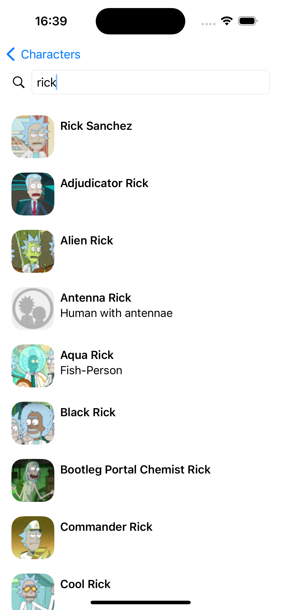
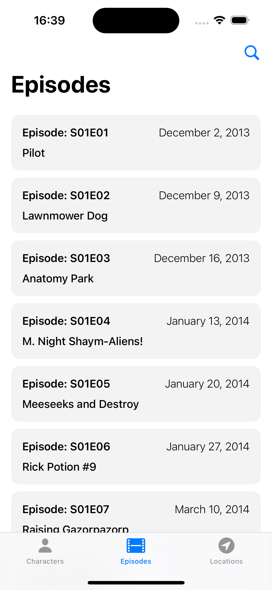
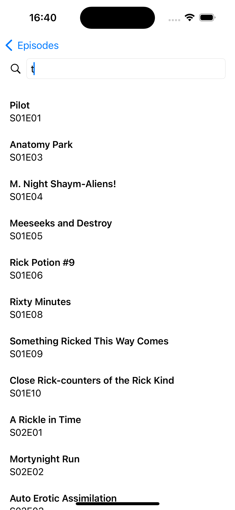
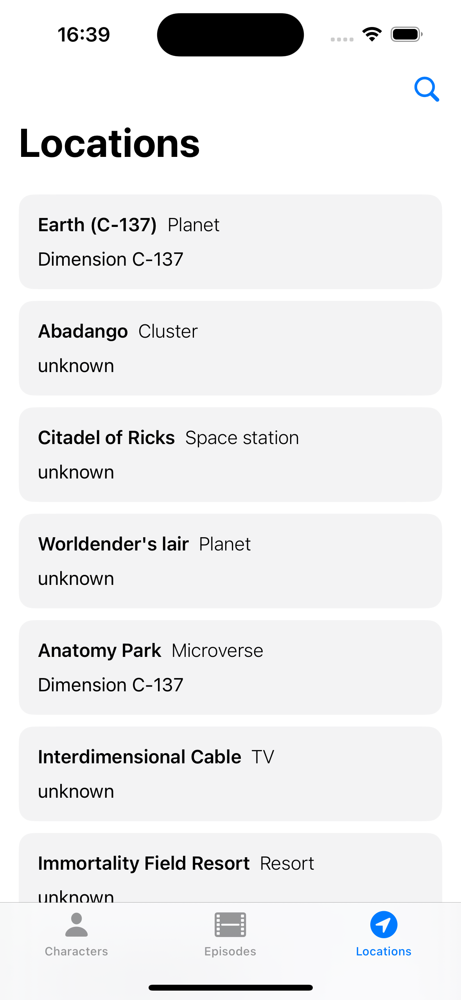
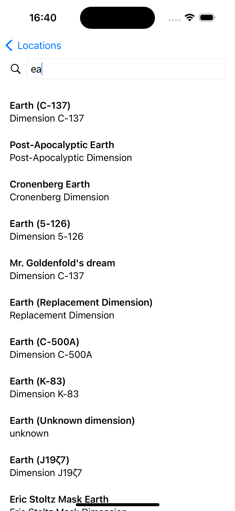

# SwiftUI TCA Rick & Morty App

Example of a simple application implementing the composable architecture (TCA)

## Composable Architecture ([about TCA](https://github.com/pointfreeco/swift-composable-architecture/tree/main))
 

 
      

## Includes

- SwiftUI
- TCA
- Apollo ios
- NukeUI
- [Rick & Morty API](https://rickandmortyapi.com/)

## Features
Possible features of the application:
- Global navigation
- Tab view
- Search
- Favorite action
- Pagination support for data
- Unit tests

## Screenshots 📷

 

 

 

 
 
 
 
  

   
## Author
* [Bogdan Zykov](https://github.com/BogdanZyk)

###

